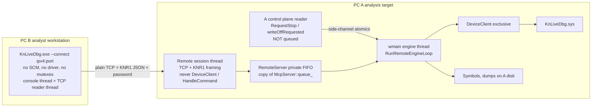
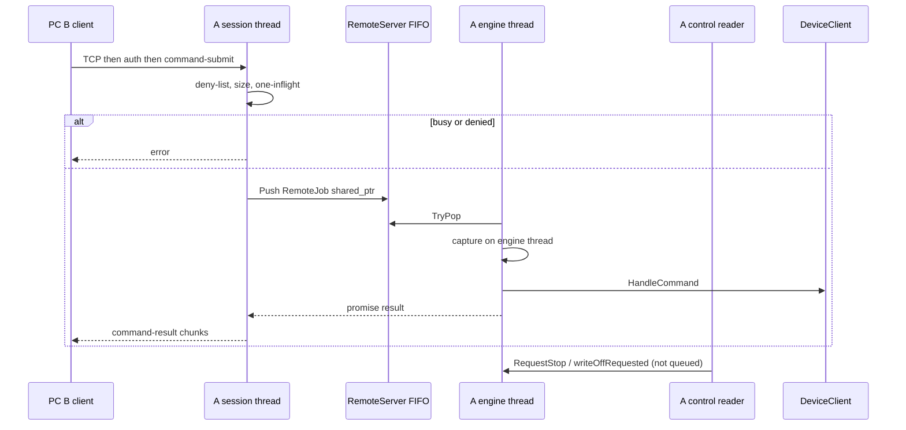
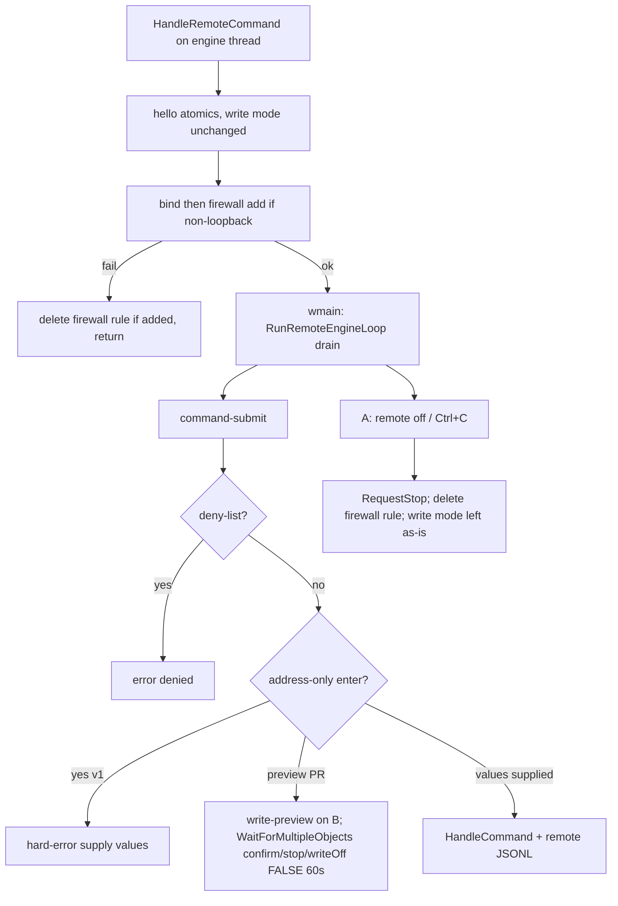

# Kn-Live-Dbg Remote Operator Session

| Field | Value |
|---|---|
| Title | Dedicated Remote Operator Session (thin TUI on PC B, engine+driver on PC A) |
| Author | Kn-Live-Dbg / 꿀보 |
| Date | 2026-08-26 |
| Status | Implemented (rev 8, 2026-08-26). Operator guide: `docs/REMOTE_SETUP.md` |
| Audience | Kn-Live-Dbg maintainers (driver ABI, user-mode engine, MCP) |
| Related | `docs/REMOTE_SETUP.md`, `docs/ARCHITECTURE.md`, `docs/MCP_SERVER_DESIGN.md`, `docs/MCP_SETUP.md`, `docs/FEATURE_PLAN.md`. Canonical copy: `docs/REMOTE_OPERATOR_SESSION.md` |

---

## Overview

PC A에서 이미 떠 있는 elevated `KnLiveDbg.exe`는 `KnLiveDbg.sys`의 exclusive handle, 심볼, DbgEng, TI ring, timeline, snapshot, AI `.env`를 소유한다. 운영자는 동일 LAN의 깨끗한 PC B에 앉아 그 세션을 `knkd>`로 쓰고 싶다. 드라이버를 네트워크에 노출하거나, B에서 두 번째 컨트롤러를 여는 방식은 현재 보안 모델과 정면으로 충돌한다.

구현은 **Dedicated Remote Operator Session**이다. A의 privileged engine은 그대로 두고, B는 같은 `KnLiveDbg.exe`를 `--connect <ipv4>:<port>`로 띄운 thin TUI client다. v1 전송은 MCP와 같은 운영 모델이다: **plain TCP + `KNR1` length-prefixed JSON + session password**. 분석 lab 전용. 커널/심볼/`HandleCommand`는 A의 기존 단일 engine thread에서만 실행한다. 운영 절차는 `docs/REMOTE_SETUP.md`. TLS 1.3 TOFU는 Appendix A에 남겨 **v2 / 후속 작업**이다.

v1에서 MCP와 remote는 **listen XOR**이다. MCP의 `McpServer::queue_`를 추출·공유하지 않는다. `RemoteServer`는 MCP와 같은 **private FIFO**를 복사한다. 공유 EngineQueue는 공존이 실제 요구가 되는 v2 일이다.

`remote on`은 opt-in, 기본 off, LAN lab 전용이다. **bare `remote on`이 다른 PC에서 붙을 수 있어야 한다** (사용자 결정): 기본 bind는 MCP와 같이 `0.0.0.0:51767`, 프로세스가 inbound 방화벽 규칙을 추가/삭제한다. **`--allow-write`는 없다.** 쓰기는 로컬 TUI와 같다 (`WriteEnabled` 기본 TRUE를 건드리지 않음). B에서 막는 것은 세션/드라이버 수명과 raw `kd`뿐이다 (`q` / `unload` / `mcp` / `kd` / `probe load`).

---

## Background & Motivation

### 현재 배포/소유권 모델

LiveKD-style 분할은 `docs/ARCHITECTURE.md`와 코드가 일치한다.

1. 드라이버 (`driver/Driver.cpp`)
   - IOCTL-only. TCP/SMB 없음.
   - `IoCreateDeviceSecure` + SDDL `D:P(A;;GA;;;SY)(A;;GA;;;BA)` — Administrators/SYSTEM만.
   - `KnDbgAcquireController`: `g_KnDbgOwnerPid`가 비어 있지 않고 현재 PID와 다르면 `STATUS_DEVICE_BUSY`.
   - `IRP_MJ_CREATE`에서 `WriteEnabled = TRUE`. 커널 write gate는 이 플래그 + `KNDBG_WRITE_ACK_MAGIC` (`shared/KnLiveDbgIoctl.h`)뿐. 실제 write 안전장치는 user-mode.
   - `--cloak`이면 `Parameters`의 `DeviceName`/`SymbolicLink`를 쓴다. 컴파일된 `\\.\KnLiveDbg`를 B가 알 수 없다 (`user/CloakSession.h`의 `UserDeviceName`).

2. User-mode 컨트롤러 (`user/main.cpp` `wmain`)
   - controller 경로는 elevation 필수.
   - `AcquireSingleInstanceLock` → `Global\KnLiveDbg.Exe.SingleInstance`. cloak면 추가 mutex `Global\<ServiceName>.s`.
   - `DeviceClient::Open` (`user/DeviceClient.cpp`): `CreateFileW(..., ShareMode=0, ...)`. lock 없음.
   - 전역 `DeviceClient device` 하나. DbgHelp/DIA/`HandleCommand`/`DeviceIoControl`은 engine thread(메인)에서만.
   - argv: `--self-test ...` 후 **`--connect` 사다리**, 그다음 `HasUnknownControllerArgv`, 그다음 `ParseCloakArgs`. `ParseCloakArgs` (`user/CloakSession.cpp`)는 unknown token을 무시하고 true를 반환하므로, `--connect`는 cloak/mutex/`device.Open` **전에** 자른다. unknown controller argv는 exit 2.

3. MCP (`user/McpServer.h`, `user/McpServer.cpp`, `docs/MCP_SERVER_DESIGN.md`)
   - in-process http.sys Streamable HTTP. 기본 bind `0.0.0.0`, 기본 포트 **51766**, session password 4–128, Bearer, **plaintext HTTP**. `mcp-endpoint.json`은 session password를 디스크에 쓴다 (`WriteMcpEndpointFile`).
   - listener는 kernel을 만지지 않고 private `std::deque<std::shared_ptr<McpJob>> queue_`에 넣는다. `McpJob`는 `{ McpEngineRequest, std::promise<McpEngineResult> }`뿐이다. `Cancelled` 없음. origin 없음.
   - `RunMcpEngineLoop`: 진입 시 `SetWriteMode(AllowWrite)`, 종료 시 **무조건** `SetWriteMode(true)`. 콘솔 reader는 queue가 아니라 `RequestStop` / `statusRequested` side-channel (`off`/`status`/`q`만).
   - `EnqueueAndWait(..., 30000, ...)`: timeout은 로컬 `engine timeout`만 세팅하고 running job을 cancel하지 않는다. `maxPending_ = 8`.
   - tool allowlist. raw `knkd>` 아님.

4. `kdinit /remote` (`user/DbgEngBackend.cpp` `AttachKernelWide(DEBUG_ATTACH_KERNEL_CONNECTION, ...)`)는 WinDbg KD attach다. KnLiveDbg 세션 이동이 아니다.

### Pain

게임 박스(A)는 더럽고 입력이 불편하다. 워크스테이션(B)은 깨끗하다. 심볼/TI/timeline/cloak는 A에 이미 있다. B의 새 프로세스는 exclusive device + mutex + cloak 이름 때문에 실패하거나 빈 세션이 된다. MCP는 LAN에서 동작하지만 인간 `knkd>`/Tab/`e*`가 아니다. remote 세션이 그 면을 채운다.

`docs/FEATURE_PLAN.md` completed slice 10. 드라이버 ABI 변경이 목표가 아니다.

---

## Goals & Non-Goals

### Goals

1. A에서 이미 running 중인 controller에 B가 붙어 **closed table에 따른 native command surface**를 실행한다 (MCP `kTools` allowlist가 아님). “전부”가 아니라 아래 Origin×command 행렬이 계약이다.
2. Privilege, exclusive `DeviceClient`, symbols, DbgEng, dumps, TI, timeline, probe, cloak identity는 A에 남긴다.
3. B는 드라이버를 로드하지 않고 cloak device name을 모른다. elevation/SCM/**두 종류 mutex**를 잡지 않는다.
4. A 로컬 **control plane**은 MCP `RequestStop`처럼 **queue를 거치지 않는다**: `remote off` / `disconnect` / `status`, `write off`, `q` / `quit` / `exit` / `unload` (teardown = `RequestStop` + `g_StopRequested`; 드라이버 unload는 기존 `wmain` cleanup), Ctrl+C. `HandleCommand("unload")`를 remote 세션 중에 queue하지 않는다.
5. `HandleCommand`를 remote-origin으로 실행하는 시점부터 **deny-list + JSONL**이 함께 존재한다. write disarm / `--allow-write`는 없다.
6. LAN trusted lab. workgroup (AD 불필요). 기본 기능 off.
7. v1 전송은 plain TCP + session password. **bare `remote on` = 모든 인터페이스.** `--loopback`만 로컬. wire 암호는 필요하면 SSH `-L` 또는 v2 Appendix A.
8. dump 수 GB는 A 디스크. 경로는 **로컬 TUI와 동일** (임의 경로, `remote-out` 강제 없음). 프로토콜 inline 금지.

### Non-Goals

1. 드라이버에 TCP/HTTP/TLS 없음.
2. `\\.\KnLiveDbg` SMB/named-pipe export 없음.
3. B를 두 번째 컨트롤러로 만들지 않음.
4. KD net / `dbgsrv` / 타깃 freeze로 풀지 않음.
5. RDP를 제품 답으로 만들지 않음 (무코드 stopgap만).
6. 인터넷 제품, 다인 협업, in-flight `!hunt` resume 없음.
7. v1에서 MCP에 TLS를 넣지 않음. MCP는 plaintext HTTP 유지.
8. v1에서 B로 multi-GB dump pull 없음.
9. remote-GDI / 원격 Win32 콘솔 attach 없음.
10. v1에서 MCP queue 추출/공유 없음.
11. v1 IPv6 / DNS 없음.
12. v1에서 Schannel / TOFU fingerprint / `--fingerprint` / `Secur32.lib` 없음 (Appendix A = v2).

---

## Constraints verified in code

| ID | Fact | Evidence |
|---|---|---|
| C1 | Single controller PID. Exclusive device. IOCTL-only. DACL BA/SY. | `KnDbgAcquireController`, `CreateFileW` ShareMode=0, SDDL `D:P(A;;GA;;;SY)(A;;GA;;;BA)` |
| C2' | `wmain`은 argv를 파싱한다. `--self-test` 다음이 `--connect` (`RemoteClientMain`), 그다음 `HasUnknownControllerArgv`, 그다음 `ParseCloakArgs`. `--connect`는 mutex/`DeviceClient`를 타지 않는다. | `user/main.cpp` `wmain` |
| C3 | `HandleCommand` / DbgHelp / 대부분의 IOCTL은 engine thread. **절대 아님:** `TimelineAutoDrainWorker`가 worker에서 `DrainTimelineLiveEvents` → `DeviceClient::DrainTimelineEvents` (및 status/control)를 `g_TimelineLiveIoMutex` 아래에서 호출한다 (`user/main.cpp` ~23167–23238). | `HandleCommand`; exception `g_TimelineLiveIoMutex` |
| C4 | `ScopedWideStreamCapture`가 process-global rdbuf swap. 동시 capture는 UAF. | `user/main.cpp` |
| C5 | Driver write default ON. User-mode가 진짜 gate. MCP만 지금 `SetWriteMode(false)`. | `WriteEnabled = TRUE`, `RunMcpEngineLoop` |
| C6 | MCP/AI catalog는 LLM용. 인간 REPL allowlist가 아니다. live `kTools[]`는 읽기 67 + 쓰기 12. | `user/McpServer.cpp` |
| C8 | `TiSubscriber`만 자체 스레드. remote도 engine queue로 넣는다. | MCP design §4.4 |
| C9 | Scanner non-cancelable. in-flight preempt 없음. MCP timeout도 running job을 안 죽인다. | `UserModeHunter::Scan`, `EnqueueAndWait` |
| C10 | `ScopedCommandProgress`는 `WriteConsoleW`. `ExecuteCommandWithTranscript`는 항상 `enabled = !args.empty()`. MCP origin disable **없음**. | `user/main.cpp` |
| C11 | MCP queue는 단일 FIFO, 깊이 8, 30s. 설계 문서 이중 deque **미구현**. `McpJob::Cancelled` **미구현**. | `McpServer::queue_` |
| C12 | `mcp on` 콘솔은 `RequestStop` side-channel. 로컬 라인을 queue에 넣지 않음. | `RunMcpEngineLoop` |
| C13 | Address-only `e*`/`pe*` → `ReadEnterPromptLine` → `std::getline(std::wcin)`. | `PromptForEnterBytes` |
| C14 | cloak `UserDeviceName` 랜덤. B는 compiled name을 `CreateFileW`하면 안 된다. cloak는 mutex **두 개**. | `CloakSession.h`, `wmain` |
| C15 | `home`은 `PrintStartupTui` 텍스트. `!timeline dashboard`는 A HTML + 로컬 브라우저. | `PrintStartupTui` |
| C16 | `dump-kernel`/`dump-live`는 A 파일에 수 GB. `IsWriteLikeCommandLine`에 **없음**. `KNDBG_MAX_TRANSFER_SIZE` 1 MB/IOCTL은 dump 파일 크기와 무관. | `IsWriteLikeCommandLine`, `MemoryDumper.h` |
| C17 | `Crypt32.lib` `Httpapi.lib` `Ws2_32.lib` 링크됨. `Secur32.lib` 없음. | `user/KnLiveDbg.vcxproj` |
| C18 | `log enable`은 path 인자가 없다. `EnableOutputLog` → `<exeDir>\KnLiveDbg-<timestamp>.log`. | `HandleLogCommand` |
| C19 | `McpValidatePath`는 MCP write tool 전용 (`..` / unsafe char / quotes). native dump는 임의 경로. | `user/main.cpp` |
| C20 | `g_EngineTid` / capture-depth assert는 MCP 설계에만 있고 **코드에 없음**. | grep empty |

---

## Design (implemented)

### Target architecture (accepted)

**Thin TUI client on B. Privileged engine + driver stay on A. Sibling protocol to MCP. v1 listen XOR. Separate private FIFO, not a shared EngineQueue extract.**



### Process / deployment

**PC A**

```text
knkd> remote on [port] [--loopback] [--bind <ipv4>] [--peer <ipv4>]
knkd> remote off | remote status | remote disconnect | remote help
```

| Flag | Effect |
|---|---|
| (bare) `remote on` | Bind **0.0.0.0:51767**. 다른 PC가 붙을 수 있다. cleartext TCP + password. inbound 방화벽 규칙을 프로세스가 추가. |
| `--loopback` | Bind **127.0.0.1**만. 방화벽 규칙 없음. 같은 박스 / SSH `-L`. |
| `--bind <ipv4>` | 그 주소만 listen. `127.0.0.1`이면 loopback과 동일 (방화벽 없음). 그 외면 방화벽 규칙 추가. |
| `--peer <ipv4>` | accept 후 그 IPv4가 아니면 reset. 방화벽 `RemoteAddresses`도 그 IP로 핀. |

`--lan` 없음. `--allow-write` 없음.

Bind 주소 결정:

1. `--loopback` 또는 `--bind 127.0.0.1` → `127.0.0.1`.
2. `--bind <non-loopback-ipv4>` → 그 주소만.
3. 그 외 (bare `remote on`) → `0.0.0.0` (multi-NIC, NIC를 찍지 않음).

- 기본 포트 **51767**. `remote on 51766`은 거부 (`MCP port; use 51767`). 포트 in-use는 MCP처럼 Start 실패 (retry 없음).
- v1 listen **IPv4 only** (`AF_INET`). `--loopback`은 `127.0.0.1`만. `::1` 약속 없음.
- Password: type+confirm, **최소 5** / 최대 128 printable ASCII, 공백 없음. `SanitizeRemotePassword`. 디스크에 안 씀 (MCP `mcp-endpoint.json`과 다른 점).
- `mcp on`과 XOR: 상대가 `IsRunning()`이면 Start 실패.
- 한 human session. 세션이 pinned면 extra TCP는 **accept 후 즉시 `closesocket`** (handshake 없음).

**왜 bare `remote on`이 0.0.0.0인가.** 사용자 결정: 별도 파라미터 없이 다른 PC에서 접속. MCP `mcp on`과 같은 bind. 인증은 session password. 쓰기는 로컬과 같다.

**PC B**

```text
KnLiveDbg.exe --connect <ipv4>:<port>
```

- 같은 EXE. `--connect`는 `--self-test` **다음**, `ParseCloakArgs` / `DriverService` / `DeviceClient` / mutex **이전**.
- IPv4 literal만 (`inet_pton`). DNS 없음. 포트 생략 없음.
- v1에 `--fingerprint` 없음. password prompt는 TCP connect **전** (auth deadline 10s).
- elevation 불필요. `AcquireSingleInstanceLock`과 cloak `Global\<ServiceName>.s` **둘 다** skip. `SetConsoleCtrlHandler(ConsoleHandler)` 등록 금지 (`g_StopRequested`는 controller용).
- unknown argv는 controller path로 떨어지지 않고 exit 2. `ParseCloakArgs`가 `--connect`를 삼키기 전에 잘라야 한다.

**`wmain` 사다리 (구현 위치)**

```cpp
int wmain(int argc, wchar_t** argv)
{
    InstallOutputTee();
    CommandRegistry::SetColorPrinter(PrintCommandRegistryColoredText);

    if (argc >= 2 && ToLower(argv[1]) == L"--self-test")
    {
        // existing branches, plus remote-protocol / connect-argv
        ...
    }

    if (argc >= 2 && ToLower(argv[1]) == L"--connect")
    {
        return RemoteClientMain(argc, argv); // no ConsoleHandler, no mutex, no DriverService
    }

    if (HasUnknownControllerArgv(argc, argv))
    {
        std::wcerr << L"unknown argument. controller accepts --cloak* only.\n";
        return 2;
    }

    CloakArgs cloakArgs = {};
    if (!ParseCloakArgs(argc, argv, &cloakArgs))
    {
        ...
    }
    // DriverService / DeviceClient / mutex only after this
}
```

`HasUnknownControllerArgv`: `--cloak` / `--cloak-resume <path>` / `--cloak-cleanup [path]` 외 토큰이면 true. 오늘 `ParseCloakArgs`가 unknown을 삼키는 사실을 이 가드로 막는다.

**`wmain` REPL 루프 (live 코드 `user/main.cpp` ~52240의 sibling).** argv 사다리만 고치고 이 분기를 안 넣으면 `HandleRemoteCommand`가 listen만 켠 채 `ReadInteractiveCommandLine`이 계속되어 C4 레이스가 난다.

```cpp
while (!g_StopRequested)
{
    if (g_RemoteServer.IsRunning())
    {
        RunRemoteEngineLoop(state, dbgeng, device, service, symbols, ai, aiState);
        continue;
    }
    if (g_McpServer.IsRunning())
    {
        RunMcpEngineLoop(state, dbgeng, device, service, symbols, ai, aiState);
        continue;
    }

    std::wstring line;
    if (!ReadInteractiveCommandLine(L"knkd> ", state.CommandHistory, &line))
    {
        break;
    }
    // existing ExecuteCommandWithTranscript ...
}
```

**hello / listen 순서 (`HandleRemoteCommand`, engine thread, Start 전):**

1. XOR 검사 (`g_McpServer.IsRunning()`이면 실패).
2. **write mode를 바꾸지 않는다.** 로컬 TUI / 드라이버 기본(`WriteEnabled = TRUE`)을 그대로 쓴다. `SetWriteMode(false)` 호출 없음. `--allow-write` 없음.
3. hello atomics: `cloak` = `DebuggerState.CloakActive`, `writeMode` = 현재 `QuerySessionStatus`의 `KNDBG_SESSION_FLAG_WRITE_ENABLED`, `abi` = `KNDBG_ABI_VERSION`. listener는 이 복사본만 읽는다.
4. `RemoteServer::Start()` — bind/listen 성공 후에만 방화벽 규칙 추가 (loopback이면 생략).
5. `Start()` 실패 시 방화벽 규칙이 이미 들어갔으면 삭제하고 return. write mode는 손대지 않았으므로 restore 없음.
6. 성공 시에만 반환 → `while`이 `RunRemoteEngineLoop`로 들어간다. `remote off`도 write mode를 원상복구하지 않는다. 세션 중 B가 `write off`를 쳤으면 그 상태가 로컬 REPL에 남는다 (로컬과 동일).

### Transport and protocol

**v1 (이 작업, 사용자 결정 최종):** plain TCP 위에 `KNR1` + u32 LE length + UTF-8 JSON. session password가 인증 장벽. MCP plaintext HTTP와 같은 lab 모델. Schannel/`--fingerprint`/`Secur32` **없음**.

**v2 (후속, Appendix A):** TLS 1.3 TOFU. 이 프로그램 of work에 넣지 않음. lab에서 wire 암호가 급하면 SSH `-L 51767:127.0.0.1:51767`로 A loopback에 붙인다 (코드 0).

- TCP accept 후 첫 애플리케이션 메시지가 `auth` (password). `ConstantTimeEqual`.
- 불완전 frame **60s** deadline. max frame 1 MiB.
- 평문 kernel-command traffic임을 `remote on` 배너에 명시 (isolated lab). `--loopback`이 아니면 listen IP 목록을 인쇄한다.

**v1 JSON 스키마 (동결).** `user/RemoteProtocol.h` 주석과 이 표가 계약이다. 공통 envelope:

| Field | Type | Required | Notes |
|---|---|---|---|
| `v` | number | yes | 1. mismatch → `error.code=unsupported-v` 후 close |
| `type` | string | yes | 아래 enum만 |
| `id` | string | yes | 클라 요청 `c-<n>`. 서버 unsolicited `s-<n>`. 응답은 요청 id echo. progress/write-preview는 해당 `command-submit` id |
| `ts` | number | yes | UTC ms |

클라가 id를 할당하는 요청: `auth`, `command-submit`, `completion-request`, `write-confirm`, `cancel`, `heartbeat`, `disconnect`.

| type | Dir | Extra fields (required unless ?) |
|---|---|---|
| `auth` | B→A | `password` string |
| `auth-ok` | A→B | `session` string (16 hex) |
| `auth-err` | A→B | `code`: `bad-password` \| `lockout` \| `protocol` |
| `hello` | A→B | `hostname`, `os`, `abi` (number, `KNDBG_ABI_VERSION`), `writeMode` bool, `cloak` bool, `bind`, `port`, `cleartext` bool (v1 always true), `caps` string[] (`command`; server also accepts `completion-request`) |
| `command-submit` | B→A | `line` string, max 8192 wchar after UTF-8 decode |
| `command-result` | A→B | `seq` int 0-based, `last` bool, `stdout` string, `stderr` string, `keepRunning` bool, `isError` bool |
| `completion-request` | B→A | `line`, `cursor` number |
| `completion-response` | A→B | `matches` string[], `listing`?, `replacement`, `appendSpace` bool |
| `progress` | A→B | `elapsedMs` number, `text` string. id = command id |
| `write-preview` | A→B | `address` hex string, `width` number, `currentHex` string, `prompt` string |
| `write-confirm` | B→A | `accept` bool, `valueLine`? |
| `cancel` | B→A | (queued only) |
| `heartbeat` | both | no extra |
| `disconnect` | both | `reason`? |
| `error` | A→B | `code`: `engine-busy` \| `denied` \| `too-large` \| `session-busy` \| `peer-not-private` \| `unsupported-v` \| `frame-timeout` \| `not-cancelable` |

**넣지 않음 (v1):** `audit-ack`, `structured` 결과, ALPN, 다수 in-flight command.

**인플라이트:** human command **하나**. 두 번째 `command-submit` / `completion-request` → `engine-busy`. 클라 Tab은 로컬이라 in-flight와 무관하게 완성한다.

**hello 데이터 출처:** `HandleRemoteCommand` **engine thread**, `Start()` **전**. `QuerySessionStatus`로 현재 writeMode만 읽고 **바꾸지 않는다.** atomics (`cloak`, live `writeMode`, abi). listener는 복사본만. listener IOCTL 금지. accept는 이 복사 이후에만.

**Auth lockout:** peer IPv4 → fail count, **프로세스 수명**. 5회 실패면 그 IP는 `auth-err lockout` + 즉시 close. 전역 실패 15회면 `remote off`까지 신규 auth 거부. 카운터는 새 TCP에도 유지 (세션이 아님). 비교는 `ConstantTimeEqual`. 실패 사이 250ms.

**타이밍**

| Knob | Default |
|---|---|
| Port | 51767; reject 51766 |
| Heartbeat | 15s |
| Dead peer / frame deadline | 60s |
| Auth deadline after TCP accept | 10s |
| Write-confirm wait | `WaitForMultipleObjects({confirm, stop, writeOff}, FALSE, 60000)` |
| Remote pending | 4; one in-flight |
| Command line | 8192 wchar |
| Result chunk | 256 KiB UTF-8 |
| Max frame | 1 MiB |
| Inline truncate | 8 MiB transcript then marker + path if any |
| Engine wait (remote command) | until complete (MCP 30s 복사 금지) |
| Password min | 5 |

### Concurrency



**v1 queue: MCP FIFO 복사, 추출 아님 (대안 H).**

`user/RemoteServer.h` private:

```cpp
enum class RemoteJobKind
{
    CommandLine = 0,
    Completion = 1
};

struct RemoteJobResult
{
    bool IsError = false;
    bool KeepRunning = true;
    std::wstring Stdout;
    std::wstring Stderr;
};

struct RemoteJob
{
    RemoteJobKind Kind;
    std::wstring CommandLine;
    size_t CompletionCursor = 0;
    std::promise<RemoteJobResult> Done;
    std::shared_ptr<std::atomic<bool>> Cancelled;
};

class RemoteServer
{
    // copy of McpServer: queueMutex_, deque<shared_ptr<RemoteJob>>,
    // jobReadyEvent_, maxPending_ = 4
    bool EnqueueAndWait(const std::shared_ptr<RemoteJob>& job,
                        uint32_t timeoutMs, // 0 = infinite; MUST NOT wait_for(0ms)
                        RemoteJobResult* result);
    std::shared_ptr<RemoteJob> TryPopJob();
    void RequestStop(); // reader-safe: running_=false, SetEvent(stopEvent_)
};
```

`EnqueueAndWait` 대기 (MCP `wait_for(milliseconds(timeoutMs))`를 그대로 복사하면 **안 된다**. MCP는 항상 `30000`만 넘긴다. `wait_for(0ms)`는 즉시 timeout이다):

```cpp
if (timeoutMs == 0)
{
    future.wait(); // INFINITE. command-submit path
}
else if (future.wait_for(std::chrono::milliseconds(timeoutMs))
         != std::future_status::ready)
{
    result->IsError = true;
    result->Text = L"engine timeout";
    return true; // job stays running (C9), shared_ptr keeps promise alive
}
*result = future.get();
```

- 명령: `timeoutMs == 0` → `future.wait()`. completion: `timeoutMs == 5000` → `wait_for`.
- `RemoteJob`는 `std::atomic` 멤버를 직접 갖지 않는다 (non-movable). `Cancelled`는 `shared_ptr<atomic<bool>>`. job 자체는 항상 `shared_ptr` (MCP와 동일: timeout/abandon 후에도 engine이 `set_value` 가능).
- MCP `McpEngineRequest`를 이 구조에 넣지 않는다.
- `McpServer::queue_`를 이 작업에서 수정하지 않는다.
- `cancel`: queue에 남아 있으면 `Cancelled=true`로 pop 시 skip. in-flight면 `not-cancelable`.

**`RunRemoteEngineLoop`** (`user/main.cpp`), `RunMcpEngineLoop` 모델. write mode는 이 루프 진입/종료에서 바꾸지 않는다.

1. control reader thread: `ReadConsoleW` (simple). **queue에 넣지 않는** 라인. HANDLE을 같이 올린다 — 200ms 루프의 atomic만으로는 60s confirm wait를 깨지 못한다.
   - `off` / `remote off` / `q` / `quit` / `exit` / `unload` → `g_RemoteServer.RequestStop()` (`running_=false` + `SetEvent(stopEvent_)`). `q` family와 `unload`는 `g_StopRequested=true` (기존 process teardown이 드라이버를 내린다). `HandleCommand("unload")`를 이 루프에서 실행하지 않는다.
   - `disconnect` / `remote disconnect` → 세션 소켓 shutdown. listen은 유지, 다시 accept. v1: `remote off`만 루프 종료.
   - `status` / `remote status` → `statusRequested`.
   - `write off` → `writeOffRequested=true` **그리고 `SetEvent(writeOffEvent_)`**. reader는 `DeviceClient`를 호출하지 않음. engine이 다음 깨는 지점(200ms 루프 또는 confirm wait)에서 `SetWriteMode(false)`. 로컬과 같이 이후 세션에 남는다.
2. engine loop: `WaitForSingleObject(JobReadyEvent, 200)`. `writeOffRequested`면 `SetWriteMode(false)` + hello writeMode atomic false + `ResetEvent(writeOffEvent_)`. `statusRequested`면 콘솔에 peer/bytes. `TryPopJob` → deny-list → `ExecuteCommandWithTranscript`.
3. 종료: `RemoteServer::Stop()` (방화벽 규칙 삭제), queued jobs fail. **write mode restore 없음.**

**Optional full local REPL:** v1 **없음**. A는 MCP와 같이 control plane만. 이유: kill switch를 in-flight `!hunt` 뒤에 넣지 않기 위함. 로컬에서 `!callbacks`를 치고 싶으면 `remote off` 후 풍부한 REPL, 또는 B에서 친다. Goal 4의 “로컬 풀 REPL”은 v1에서 명시적으로 뺀다.

**write-confirm wait (not shipped; address-only enter is hard-error):**

```cpp
HANDLE waits[3] = { confirmEvent, stopEvent, writeOffEvent };
DWORD wr = WaitForMultipleObjects(3, waits, FALSE, 60000);
// bWaitAll = FALSE
if (wr != WAIT_OBJECT_0)
{
    // stop, writeOff, timeout, or abandoned => no write
}
```

control reader가 `stopEvent` / `writeOffEvent`에 `SetEvent`를 하지 않으면 engine은 60s 동안 atomic을 보지 못한다. wait 중에 atomic을 폴링하지 않는다. 아무 non-confirm 결과든 write 없음.

**클라이언트 스레드**

| Thread | Owns |
|---|---|
| Main | 콘솔 라인 편집, **로컬 Tab** (`ApplyTabCompletion`), 로컬 history/`cls`, prompt. 명령은 `command-submit` |
| Reader | TCP recv loop. demux heartbeat/progress/result/error/write-preview/disconnect |
| (none extra) | Send는 `sendMutex_`로 프레임 직렬화 (한 소켓에 두 스레드 write 금지) |

Main이 blocking `recv`를 하지 않는다. Ctrl+C: 입력 중이면 라인 clear. in-flight면 `cancel` 송신 (queued-only). `ConsoleHandler` 미등록.

`InstallOutputTee()`는 `wmain` 최상단이라 client에도 깔린다. 허용. `log enable`은 client에 없다.

### Command surface

Remote human은 raw 라인을 `HandleCommand`에 넣는다. 계약은 **아래 닫힌 표**다.

매칭 API (`CommandRegistry::Normalize`는 lowercase + `dd`/`dw`/`ed`/`ef`만 한다. alias 매핑이 **없다**. `sympath` → `.sympath`는 `Find`의 `Canonical`에만 있다):

```cpp
static std::wstring RemoteCanonicalToken(const std::wstring& token)
{
    const CommandInfo* info = CommandRegistry::Find(token);
    if (info != nullptr && info->Canonical != nullptr)
    {
        return info->Canonical; // dashboard->home, quit/exit->q, sympath->.sympath
    }
    return NormalizeInputCommand(token);
}
```

deny-list만 이 canonical(+ args)에 건다. `sympath \\evil\symbols`는 `.sympath` + extra args → Deny. **path rewrite 없음. write-like Arm 게이트 없음.** dump/snapshot 경로는 로컬 TUI와 같다.

게이트 순서 (engine, command-submit PR부터). listener도 deny-list를 같은 함수로 한 번 더 실행하고, 실패면 enqueue하지 않는다.

1. deny-list → `denied`
2. address-only enter (`PromptForEnterBytes`가 필요한 형태) → v1 command-submit PR에서는 **hard-error** `supply values on the command line`. write-preview PR 전엔 `getline(wcin)` 경로 진입 금지
3. else `ExecuteCommandWithTranscript(origin="remote", enableConsoleProgress=false, sink=...)`

`write on` / `write off`는 B에서 Allow — `HandleCommand`가 로컬과 같이 처리한다.

#### Origin × command matrix (v1 closed)

Legend: **Deny** = remote origin 거절. **Allow** = 로컬 TUI와 동일 (쓰기 포함). `--allow-write` / Arm 없음.

| Canonical / pattern | Class | Remote | Notes |
|---|---|---|---|
| `q` `qq` `qd` (`quit` `exit` aliases) | session-lifetime | Deny | A control plane only |
| `unload` | SCM | Deny from B | A control plane: `q`와 같음 (`RequestStop` + `g_StopRequested`) |
| `mcp` * | session-lifetime | Deny | XOR topology |
| `remote` * | session-lifetime | Deny | B uses protocol disconnect |
| `write on` `write off` `write` | session | Allow | 로컬과 동일. remote on이 write mode를 바꾸지 않음 |
| `probe load` `probe unload` | SCM | Deny | |
| `probe` other (`status`/`info`) | read | Allow | |
| `!byovd fixture load`/`unload` | SCM | Deny | write-like in code too |
| `kd` | dbgeng passthrough | Deny | hang/crash. Key Decision |
| `kdinit` * including `/local` | session-lifetime | Deny | `/remote`는 잘못된 레이어 + 전부 deny |
| `kddetach` | session-lifetime | Deny | |
| `backend` * | session-lifetime | Deny | `backend dbgeng`는 A 라우팅을 바꿈 |
| `.sympath` with extra args, `.sympath+` | session | Deny | symbol server / SMB 경로 |
| `.sympath` no args | read | Allow | |
| `.reload` | read | Allow | |
| `set-ppl-antimalware` `setfield` `e*` `pe*` `!callbacks disable*` `dump-*` `!snapshot` `!diff` `!ti` `!timeline` `ai` | 로컬과 동일 | Allow | 경로 rewrite 없음. 기본 dump/snapshot 경로는 로컬 TUI와 같음 |
| address-only `e*`/`pe*` | kernel-write | Allow | v1 command-submit: hard-error `supply values on the command line`. preview PR 전 `getline(wcin)` 금지 |
| `log enable\|disable\|status` | filesystem | Deny | path 인자 없음. A 디스크 tee |
| `home` `cls` | ux | `home` Allow (text capture). `cls`는 **클라 로컬만**, submit하지 않음 | |
| native scanners (`!callbacks` list, `!hunt`, `dt`, `d*`, `u`…) | read | Allow | |
| unknown / DbgEng-only names | — | Deny | `CommandRegistry::Find` miss + `ShouldRouteToDbgEng` → deny (raw kd 우회 방지) |

`IsRemoteDeniedCommandLine`만 `IsWriteLikeCommandLine` 옆에 둔다. **구현 한 함수, listener와 engine 두 호출자.** path rewrite 헬퍼 없음. `ApplyRemotePathPolicy` / `IsRemoteFilesystemWriteCommandLine` / `remote-out` **없음**.

표에 없는 native 명령은 Allow (로컬과 동일). Deny는 위 닫힌 목록 + unknown/DbgEng-only.

**`PromptForEnterBytes`:** origin remote이면 command-submit PR에서 함수 진입 전에 hard-error. write-preview PR에서 origin을 인자로 받고, wcin 대신 protocol confirm. 확인은 B 프로토콜이지 A 콘솔이 아니다. A per-write confirm 없음.

### Writes and kill switch



쓰기는 로컬과 같다. `--allow-write` 없음. A per-write confirm 없음. 잔여: stolen password + LAN = kernel RW **and** cleartext. 완화: password min 5, IP lockout, `--peer`, RFC1918 peer 기본, 프로세스 방화벽 규칙, A `remote off`, isolated lab. wire 암호가 필요하면 SSH `-L` 또는 v2 Appendix A.

### Auth / network

- **v1 `remote on`은 평문 kernel-command traffic.** isolated lab segment에서만. 배너에 그 사실을 인쇄. 공유 사무실 LAN / 인터넷에 열지 않음. wire 암호가 필요하면 `ssh -L 51767:127.0.0.1:51767` 후 `--loopback`, 또는 v2 Appendix A.
- non-loopback일 때 peer가 RFC1918/loopback/link-local이 아니면 accept-reset. 끄려면 `--allow-public-peer`.
- workgroup. AD 없음.

**방화벽 (사용자 결정: 프로세스가 추가/삭제).** loopback이면 규칙을 만들지 않는다. 그 외:

1. `INetFwPolicy2` / `INetFwRule` COM (`ole32`, 이미 DIA COM으로 프로세스에 COM 있음). PowerShell/`netsh` spawn 금지.
2. DisplayName `knlivedbg-remote`. inbound TCP, LocalPorts = 실제 listen port, Action Allow, Enabled, Profiles = DOMAIN|PRIVATE|PUBLIC.
3. RemoteAddresses: `--peer`가 있으면 그 IPv4, 없으면 `*`.
4. `Start()` bind 성공 후: 같은 이름 규칙이 있으면 삭제(crash leftover) 후 추가. COM 실패는 Start를 실패시키지 않고 경고만 (`firewall rule failed, inbound may be blocked`).
5. `remote off` / `RunRemoteEngineLoop` 종료 / `wmain` cleanup: 같은 이름 삭제. 없면 무시.
6. 설치 시 영구 규칙 없음.

### Client UX on B (implemented)

- `knkd>` line editor: `_getwch`, 로컬 history, 화살표, Home/End. Ctrl+C는 입력 중이면 라인 clear.
- **Tab은 로컬** `ApplyTabCompletion` / `CollectCompletionCandidates` (`user/CompletionHints.cpp`). A TUI와 **같은 테이블**. 모호한 prefix는 annotated listing. `remote on <Tab>`은 `--loopback` / `--bind` / `--peer`. 클라 Tab은 `completion-request`를 보내지 않는다 (프로토콜 타입은 서버에 남아 있음).
- `cls`는 클라 로컬. `disconnect` / `q` / `quit` / `exit`는 프로토콜 disconnect (A `HandleCommand`로 안 감).
- Password: TCP 후 prompt. **5–128** printable ASCII, 공백 없음 (`SanitizeRemotePassword`, `kPasswordMin=5`).
- Address-only `e*`/`pe*`: hard-error `supply values on the command line`. write-preview는 **미구현**.
- 배너: hello 필드 (`cleartext=true` on v1). A non-loopback이면 평문 경고 + listen IP 목록.
- 재연결 = 새 세션. password를 다시 친다.
- Exit codes:

| Code | Meaning |
|---|---|
| 0 | graceful `disconnect` after auth |
| 2 | argv (`--connect` 형식, non-IPv4) |
| 4 | auth-err |
| 5 | peer drop / frame-timeout / dead peer |
| 6 | protocol (`unsupported-v`, unexpected type) |
| 1 | other |

### Observability

`<exeDir>\.kn-live-dbg\remote-audit-<port>.jsonl`. `remote on` 동안 항상 ON. MCP `ai audit` 토글과 독립.

필드: `ts`, `peerIp`, `peerPort`, `session`, `origin=remote`, `command` (max 512, `MaybeRedactTranscriptText` **기본 ON**), `decision`, `writeMode`, `durationMs`, `resultBytes`, `deniedReason`. seq 필드 없음 (audit-ack 없음). `--allow-write`/`writeArmed` 필드 없음.

Rotation: 64 MiB에서 `remote-audit-<port>.1.jsonl`로 rotate, 2본 유지.

`remote status` (A 콘솔, control plane): bind, write, peer, uptime, last command, bytes, queued, inflight, cleartext=v1.

Connect/disconnect는 `PrintConsoleOnly` 한 줄 (tee/`log enable`과 별개 핸들 — 로컬 `log enable`이 켜져 있으면 tee도 받을 수 있음. remote origin은 `log enable` deny라 B가 켜진 수는 없다. A 로컬이 미리 log를 켰으면 그대로 파일에도 남음).

---

## API / Interface Changes

드라이버 ABI 15 변경 없음.

| Area | Change |
|---|---|
| `user/RemoteProtocol.h` | envelope, type strings, caps, frozen schema comments |
| `user/RemoteServer.h/.cpp` | Winsock listen, FIFO, audit, lockout, hello atomics |
| `user/RemoteClient.h/.cpp` | `--connect` (no fingerprint) |
| `user/main.cpp` | argv 사다리, REPL `g_RemoteServer.IsRunning()` 분기, `HasUnknownControllerArgv`, `HandleRemoteCommand` (write mode **unchanged**; firewall add after bind), `RunRemoteEngineLoop`, `IsRemoteDeniedCommandLine`, `Find()->Canonical`, `ExecuteCommandWithTranscript` ProgressSink + `enableConsoleProgress`, `g_EngineTid` at `HandleCommand` / capture / remote dispatch, `PromptForEnterBytes` origin |
| `user/RemoteFirewall.h/.cpp` | `INetFwPolicy2` add/remove `knlivedbg-remote` |
| `user/DeviceClient.cpp` | **tid assert 없음** (`DrainTimelineEvents` worker 예외) |
| `user/CommandRegistry.cpp` | `remote` session command |
| `user/CompletionHints.cpp` | `remote` / `--connect` |
| `user/KnLiveDbg.vcxproj` | new cpp. **v1에 `Secur32.lib` / `Ncrypt.lib` 없음** (`Ws2_32.lib` already linked) |
| `user/McpSelfTest.cpp` 패턴 | `RunRemoteProtocolSelfTest` (loopback TCP framing + password, no TLS), `RunConnectArgvSelfTest` |
| `tools/validate-remote-protocol.ps1` | driver-free gate |
| docs | README `kdinit /remote` vs `remote on` |

`McpServer::queue_` / `RunMcpEngineLoop` **무변경** (XOR v1).

`ExecuteCommandWithTranscript` 시그니처 변경 (호환 기본값으로 MCP 경로 유지):

```cpp
struct ProgressSink
{
    virtual void OnProgress(uint64_t elapsedMs, const wchar_t* text) = 0;
    virtual ~ProgressSink() {}
};

static CommandExecutionResult ExecuteCommandWithTranscript(
    ...,
    ProgressSink* progressSink = nullptr,
    bool enableConsoleProgress = true);
```

MCP 호출은 오늘과 같이 `enableConsoleProgress=true` (회귀 없음). remote는 `false` + sink. **이것은 신규 훅이다. MCP가 이미 origin disable을 한다는 주장은 거짓이다.**

`ProgressSink::OnProgress`는 mutex로 thread-safe. remote command PR 이후 progress PR에서: console worker 금지, timer worker는 sink만 호출, session thread가 frame을 보낸다. 또는 engine이 HandleCommand **전후**에만 찍으면 긴 hunt 동안 progress가 없다 — 그래서 timer worker → sink가 맞다. worker는 `wcout`/`WriteConsoleW` 금지.

`g_EngineTid`: `wmain` controller path에서 DuplicateHandle 직후 저장. debug assert 위치는 `HandleCommand` 진입, `ScopedWideStreamCapture` ctor, remote-origin dispatch뿐. **`DeviceClient::Ioctl`에 넣지 않는다** — `TimelineAutoDrainWorker`가 이미 `DrainTimelineEvents`를 engine 밖에서 친다 (`g_TimelineLiveIoMutex`). 그 IOCTL은 기존 예외로 남긴다. C3를 “모든 IOCTL = engine thread”로 주장하지 않는다.

---

## Data Model Changes

커널 스키마 없음.

| Path | Lifetime |
|---|---|
| `<exeDir>\.kn-live-dbg\remote-audit-<port>.jsonl` (+ `.1`) | rotate 64 MiB |

Password 디스크 파일 없음. dump/snapshot 경로는 로컬 TUI 기본값 (`<exeDir>\.kn-live-dbg\snapshots` 등). `remote-out` 디렉터리 없음.

---

## Alternatives Considered

### A. RDP / 물리 콘솔 / Synergy

무코드 stopgap. A 입력 스택을 더럽힘. 타깃 아님.

### B. SSH / ncat로 기존 콘솔 파이프

이미 뜬 세션에 attach가 아님. 새 프로세스는 C1에 막힘. `ReadInteractiveCommandLine`/`WriteConsoleW`는 pipe에서 깨짐. 기각. `--loopback` + SSH `-L`는 전송 옵션으로만.

### C. 기존 MCP를 인간 UI로

오늘 동작. typed tools, Tab 없음, 30s, plaintext. LLM frontend로 유지.

### D. MCP에 raw `knkd>` 추가

LLM 가드 (`no raw command string`)를 허묾. 기각.

### E. Dedicated Remote Operator Session (채택)

인간 UX, cloak-safe, A kill switch. v1 XOR + private FIFO.

### F. KD net / dbgsrv

타깃 freeze. `kdinit /remote`가 이 레이어. 기각.

### G. Split IOCTL proxy

네트워크 메모리 primitive. 기각.

### H. XOR frontends, MCP private FIFO **복사**, EngineQueue 추출 없음 (v1 채택)

- 장점: `McpServer::queue_`를 안 건드림. `validate-mcp-tool-catalog.ps1`이 안 재는 live queue를 옮기지 않음. XOR이면 공유 큐 YAGNI.
- 단점: 공존 시 추출 PR이 다시 필요.
- 결정: **v1 채택**. 공유 타입은 v2, variant payload, `PopMcp` vs `PopRemote` 분리, MCP 30s/깊이8 golden test와 함께.

### I. 기본 loopback + SSH `-L`가 LAN 경로

- 장점: bind-all + 짧은 암호의 면적이 사라짐.
- 단점: 두 PC lab마다 SSH 데몬. 원 요청은 같은 LAN에서 `remote on` 한 줄.
- 결정: **사용자 번복 — bare `remote on` = 0.0.0.0.** `--loopback`만 로컬. SSH `-L`은 선택. v1은 평문.

### J. `KnLiveDbgClient.exe` 분리

- 장점: B가 elevate+SCM 경로에 들어갈 수 없음.
- 단점: 두 아티팩트, cloak copy, release zip, self-test.
- 결정: **같은 EXE 유지**. 완화: `--connect`를 cloak/mutex **전**에 자르고, unknown argv는 exit 2 (`HasUnknownControllerArgv`). `--self-test connect-argv`가 mutex를 안 잡는지 断言.

---

## Security & Privacy Considerations

상대: trusted lab LAN. 그래도 raw kernel RW 포트다.

| Threat | Sev | Mitigation |
|---|---|---|
| Lab peer + stolen password | High | min 5, process-lifetime IP lockout, `--peer`, RFC1918 peer default, process firewall rule, A `RequestStop`. **writes are on** (사용자 결정) |
| Wire sniff | High (accepted for v1 lab) | **v1 is cleartext.** isolated lab segment only. banner warns. Encrypt later: SSH `-L` or Appendix A (v2) |
| MITM | High (accepted for v1 lab) | same as sniff. password still required; does not stop active MITM |
| B workstation stolen while session up | High | 60s dead peer; `remote off` on A |
| Extra TCP DoS | Med | accept-then-reset, no TLS handshake cost |
| Slowloris 1 MiB frame | Med | 60s frame deadline |
| Second controller | High if allowed | C1 + client never `CreateFileW` |
| Driver TCP | Crit | 하지 않음 |
| rdbuf UAF | High | capture engine-only; new tid assert |
| `getline` on A stdin from remote enter | High | hard-error until preview |
| B dumps to arbitrary A path | Med (accepted) | 로컬 TUI와 동일 (사용자 결정). `remote-out` 강제 없음 |
| unknown argv loads driver on B | High | hard error before cloak parse |
| `ai` confused deputy / key spend | Med | accepted Allow (사용자 결정); `KNLIVEDBG_AI_REMOTE_POLICY=local-only` 권고 |
| `kd` hang | High | Deny |
| `probe load` from B | High if allowed | Deny (사용자 결정) |
| JSONL kernel bytes | Med | redact default on, 512 command cap, 64 MiB rotate |
| Leftover firewall rule | Med | Start 때 같은 이름 삭제 후 추가. off/cleanup 때 삭제 |

---

## Observability

JSONL + `remote status` + connect/disconnect 콘솔 한 줄.

Atom 카운터: sessions, commands ok/denied/busy, bytes in/out, last duration. v1 콘솔 only.

---

## Testing

물리 2호기 없음.

1. **`KnLiveDbg.exe --self-test remote-protocol`**  
   loopback **plain TCP** framing (no TLS). magic reject, oversize, 60s deadline (short test timeout), password compare, deny-list unit. default bind parser is `0.0.0.0`; `--loopback` is `127.0.0.1`.  
   `tools/validate-remote-protocol.ps1` post-build.

2. **`--self-test connect-argv`**  
   `--connect` 분기가 `AcquireSingleInstanceLock` / cloak mutex / `DeviceClient`를 안 타는지. debug log 또는 함수 포인터 훅 없이: 파서 함수를 self-test에서 직접 호출 (`ParseRemoteConnectArgs` + `HasUnknownControllerArgv`).

3. **Two-process loopback (lab, not default CI)**  
   A elevated `remote on --loopback` (driver 있음). B `KnLiveDbg.exe --connect 127.0.0.1:51767`. cloak A에 대해 **두 mutex skip** 수동 항목.

4. **MCP 회귀**  
   queue를 안 옮기므로 `validate-mcp-tool-catalog.ps1` + 기존 console self-test. `mcp on` live queue golden은 이 작업의 범위가 아님.

5. **`--self-test all`**  
   timeline + mcp-tools + console만. remote-protocol / connect-argv는 **넣지 않음**. 별도 `tools/validate-remote-protocol.ps1`.

Merge gate (command-submit, shipped):

1. remote-origin `q` / `unload` / `kd` / `mcp` / `probe load`는 `HandleCommand` 전에 `denied`.
2. remote-origin `eb <addr> <bytes>`는 write IOCTL까지 간다 (write disarm 없음).
3. remote-origin `!snapshot baseline`은 로컬과 같이 기본 snapshot 경로에 JSON+MD를 만든다 (`remote-out` 없음).

---

## Rollout Plan

Feature default off. v1 listen/command-submit/deny-list/local Tab/docs는 **shipped**. write-preview (PR5 초안)와 TLS (Appendix A)는 이 빌드에 **없음**.

Rollback: `remote off` (방화벽 규칙 삭제) / 바이너리 revert. 드라이버 롤백 없음.

---

## Risks

| Risk | Sev | Mitigation |
|---|---|---|
| command-exec PR에 deny-list가 빠진다 | Crit | 같은 PR에 넣음 |
| bare `remote on` cleartext on shared LAN | High | isolated lab only; banner; SSH `-L` if needed; Appendix A is v2 |
| C9 hunt가 off를 늦춤 | Med | control plane은 queue 밖; in-flight는 정직하게 끝까지. Ctrl+C/`g_StopRequested`는 기존 teardown |
| same EXE forget `--connect` | High | unknown argv exit 2 |
| firewall COM 실패 | Med | Start는 계속. 경고 인쇄. inbound는 운영자가 봄 |
| progress worker가 다시 WriteConsoleW | Med | remote에서 enableConsoleProgress=false 테스트 |

---

## Open Questions

**전부 사용자 결정으로 resolved (2026-08-26). 번복하지 않음.**

1. **TLS / transport** — **resolved: v1 = plain TCP + KNR1 + session password.** 분석 lab이라 TLS는 필수가 아님. Appendix A (Schannel TOFU)는 **v2 / follow-up**, 이 작업에 넣지 않음. wire 암호가 급하면 SSH `-L`.
2. **`--allow-write`** — **resolved: 플래그 없음.** 쓰기는 로컬 TUI와 동일. A per-write confirm 없음.
3. v1 XOR + copy FIFO — 이전 구현 결정, 유지.
4. 같은 EXE `--connect` — 유지.
5. **MCP TLS** — **resolved: 이 작업에 넣지 않음.** MCP는 plaintext HTTP.
6. **`ai`** — **resolved: default Allow from B.** 운영 권고 `KNLIVEDBG_AI_REMOTE_POLICY=local-only`.
7. **`probe load`** — **resolved: Deny from B.** SCM/fixture는 A만.
8. unnamed NCrypt — **deferred to v2** (Appendix A). v1에 키/cert 없음.
9. **bare `remote on` bind** — **resolved: 0.0.0.0.** `--lan` 삭제. `--loopback`만 로컬.
10. **방화벽** — **resolved: 프로세스가 `knlivedbg-remote` 추가/삭제.**
11. **dump 경로** — **resolved: 로컬과 동일, 임의 경로.** `remote-out` 없음.
12. **B session-lifetime** — **resolved: `q` / `unload` / `mcp` / `kd` / `probe load` Deny.**

---

## References

- `docs/REMOTE_SETUP.md` — operator procedure
- `docs/ARCHITECTURE.md`, `docs/MCP_SERVER_DESIGN.md`, `docs/MCP_SETUP.md`, `docs/FEATURE_PLAN.md`
- `README.md` — `kdinit /remote` ≠ this
- `user/McpServer.h/.cpp` — private FIFO, port 51766, no Cancelled
- `user/main.cpp` — `wmain`, `RunMcpEngineLoop`, `RequestStop` side-channel, `IsWriteLikeCommandLine`, `McpValidatePath`, `EnableOutputLog`, `PromptForEnterBytes`
- `user/CloakSession.cpp` — `ParseCloakArgs` swallows unknown
- `user/DeviceClient.cpp` — ShareMode=0
- `user/DbgEngBackend.cpp` — `DEBUG_ATTACH_KERNEL_CONNECTION`
- `driver/Driver.cpp` — `WriteEnabled = TRUE`, SDDL
- `shared/KnLiveDbgIoctl.h` — ABI 15
- `user/KnLiveDbg.vcxproj` — no Secur32

---

## Appendix A — TLS 1.3 TOFU (**v2 / follow-up, not this program of work**)

v1은 plain TCP다. 아래는 lab이 나중에 wire 암호를 제품 안으로 넣을 때의 구현 메모다. `Secur32.lib` / `Ncrypt.lib` / `--fingerprint`는 이 PR 시퀀스에 포함하지 않는다. 급하면 SSH `-L`.

### Key + cert (server, `remote on` engine thread or Start before listen)

1. `NCryptOpenStorageProvider(&hProv, MS_KEY_STORAGE_PROVIDER, 0)`.
2. `NCryptCreatePersistedKey(hProv, &hKey, BCRYPT_ECDSA_P256_ALGORITHM, NULL, 0, 0)` — **pszKeyName NULL = temporary, not persisted**.
3. `NCryptFinalizeKey(hKey, 0)`.
4. `CRYPT_KEY_PROV_INFO` with `dwProvType=0` (NCrypt), `pwszContainerName=NULL`, `NCRYPT_SILENT_FLAG`.
5. Subject `CN=KnLiveDbg-Remote`. Validity 7 days. v1 `pExtensions=NULL` — **EKU serverAuth를 넣지 않는다** (extension blob을 안 만들면 프로즈에 EKU를 적지 않음). Pin-only client는 EKU를 보지 않음.
6. `PCCERT_CONTEXT pCert = CertCreateSelfSignCertificate(hKey, &nameBlob, 0, &keyProvInfo, NULL, &notBefore, &notAfter, NULL)`.
7. Unnamed NCrypt key는 container lookup이 없다. Schannel이 쓰려면 즉시:

```cpp
CERT_KEY_CONTEXT keyCtx = {};
keyCtx.cbSize = sizeof(keyCtx);
keyCtx.hNCryptKey = hKey;
keyCtx.dwKeySpec = CERT_NCRYPT_KEY_SPEC;
CertSetCertificateContextProperty(
    pCert,
    CERT_KEY_CONTEXT_PROP_ID,
    0,
    &keyCtx);
```

`hKey`는 `FreeCredentialsHandle` / `DeleteSecurityContext` **이후**에만 `NCryptFreeObject`. `AcquireCredentialsHandle` 전에 풀면 `SEC_E_NO_CREDENTIALS`.
8. Fingerprint: `BCryptHash` SHA-256 over `pCert->pbCertEncoded` / `cbCertEncoded`. Format to 64 lowercase hex with `0123456789abcdef`. Print `fingerprint=<64hex>` (no `SHA256:` on A 콘솔; CLI parser accepts optional prefix).
9. `remote off`: `FreeCredentialsHandle`, `DeleteSecurityContext`, then `CertFreeCertificateContext`, then `NCryptFreeObject(hKey)`, `NCryptFreeObject(hProv)`. Self-test: named ECDSA key count unchanged **and** loopback `AcquireCredentialsHandle` returns `SEC_E_OK`.

### Schannel server

- `AcquireCredentialsHandleW(NULL, UNISP_NAME_W, SECPKG_CRED_INBOUND, NULL, &schCred, NULL, NULL, &cred, NULL)`.
- `SCH_CREDENTIALS` (`dwVersion = SCH_CREDENTIALS_VERSION`): `cCreds=1`, `paCred=&pCert`, `dwFlags = SCH_USE_STRONG_CRYPTO`, `cTlsParameters=1`.
- `TLS_PARAMETERS.grbitDisabledProtocols` = all **except** `SP_PROT_TLS1_3_SERVER` (disable SSL3/TLS1.0/1.1/1.2/DTLS).
- Accept: `AcceptSecurityContext` with `ASC_REQ_SEQUENCE_DETECT | ASC_REQ_REPLAY_DETECT | ASC_REQ_CONFIDENTIALITY | ASC_REQ_STREAM | ASC_REQ_ALLOCATE_MEMORY`.
- Extra buffers: standard stream header/data/trailer/`SECBUFFER_EXTRA` loop. leftover bytes stay in session recv buffer.
- App record: DecryptMessage → parse complete KNR1 frames. Outbound: build frame then EncryptMessage (`SECBUFFER_STREAM_HEADER`, `DATA`, `TRAILER`).
- No client cert. No ALPN. No SNI check.

### Schannel client

- `SCH_CREDENTIALS` with **no** server cert in `paCred`. `dwFlags = SCH_USE_STRONG_CRYPTO | SCH_CRED_MANUAL_CRED_VALIDATION | SCH_CRED_NO_SERVERNAME_CHECK`.
- `TLS_PARAMETERS` disable everything except `SP_PROT_TLS1_3_CLIENT`.
- `InitializeSecurityContextW` target name unused for pin (empty or IP string ok). Flags:

```text
ISC_REQ_SEQUENCE_DETECT | ISC_REQ_REPLAY_DETECT | ISC_REQ_CONFIDENTIALITY |
ISC_REQ_STREAM | ISC_REQ_ALLOCATE_MEMORY | ISC_REQ_MANUAL_CRED_VALIDATION
```

`SCH_CRED_MANUAL_CRED_VALIDATION`만으로는 self-signed가 `SEC_E_UNTRUSTED_ROOT`로 handshake 전에 죽을 수 있다. `ISC_REQ_MANUAL_CRED_VALIDATION`을 context에 넣어야 `SECPKG_ATTR_REMOTE_CERT_CONTEXT`까지 간다.
- After `SEC_E_OK`: `QueryContextAttributes(SECPKG_ATTR_REMOTE_CERT_CONTEXT)`, hash `pbCertEncoded`, `ConstantTimeEqual` to pin. Fail → `DeleteSecurityContext`, no `auth` message, exit 3.

### Fingerprint CLI

Normalize: strip whitespace, strip leading `SHA256:`/`sha256:`, strip `:`. Remaining must be 64 hex. Store lowercase. Compare constant-time.

### v1 vs this appendix

v1 listen/client already speak raw TCP + KNR1. This appendix would wrap that stream in Schannel. Do not add `--insecure-loopback` to v1 (everything is already cleartext).

### Link (v2 only)

`Secur32.lib`, `Ncrypt.lib`. v1 uses existing `Ws2_32.lib` only. `WSAStartup` in `RemoteServer::Start` and `RemoteClientMain` (v1 already). Port conflict with MCP: XOR; `remote on 51766` rejected.

---

## Key Decisions

1. **타깃은 Dedicated Remote Operator Session (E).** G/F/C/D/B 기각. RDP는 stopgap.
2. **Privilege와 live state는 A에만.** B는 thin TUI. cloak device name을 B가 모른다. client는 **두 mutex**를 skip.
3. **인간 surface는 closed matrix의 raw `HandleCommand`.** MCP `kTools`가 아님. `kd`/`kdinit`/`backend`은 Deny (hang + 세션 라우팅).
4. **v1 queue는 MCP private FIFO 복사 (H).** `McpServer::queue_` 추출은 v2. Overview에서 “공유 EngineQueue”를 주장하지 않는다.
5. **v1 listen XOR.** A control plane은 `RequestStop` side-channel. optional 로컬 풀 REPL은 v1에 없음.
6. **v1 transport = plain TCP + KNR1 + password min 5.** TLS TOFU는 Appendix A, v2. SSH `-L`은 선택.
7. **bare `remote on` = 0.0.0.0:51767.** `--loopback`만 127.0.0.1. `--lan` / `--allow-write` 없음. 프로세스가 방화벽 규칙을 추가/삭제.
8. **쓰기는 로컬 TUI와 동일.** write disarm 없음. dump 경로는 로컬과 같음. deny-list는 세션 수명/`kd`/`probe load`만. `HandleCommand`를 여는 PR에 deny-list + audit.
9. **같은 EXE `--connect`.** unknown argv hard error. `--connect`는 `ParseCloakArgs` 전.
10. **ABI 15 유지. feature default off. IPv4 only. port 51767. reject 51766.**
11. **address-only enter는 hard-error `supply values on the command line`.** write-preview는 미구현. A per-write confirm 없음.
12. **ProgressSink / g_EngineTid / queued cancel은 신규 작업.** tid assert는 `HandleCommand`/capture/remote dispatch. `DeviceClient::Ioctl` 아님 (`DrainTimelineEvents` 예외).
13. **`ai` from B = Allow.** 운영 권고 `KNLIVEDBG_AI_REMOTE_POLICY=local-only`.
14. **`probe load` from B = Deny.** SCM은 A.

---

## Implementation status

MCP `queue_`는 손대지 않았다. `mcp on`과 listen XOR.

| Slice | Status |
|---|---|
| TCP listen + KNR1 + password min 5 + hello + firewall `knlivedbg-remote` | shipped |
| `KnLiveDbg.exe --connect` (no mutex / driver / elevation) | shipped |
| command-submit + deny-list + JSONL audit + address-only hard-error | shipped |
| B Tab = local `ApplyTabCompletion` (same `CompletionHints` as A) | shipped |
| `completion-request` on the wire | server accepts; shipped client Tab does not send it |
| ProgressSink progress frames | not shipped (A still uses console progress disabled for remote origin) |
| write-preview / write-confirm on B | not shipped; address-only enter is hard-error |
| docs (`REMOTE_SETUP.md`, README, FEATURE_PLAN, `kdinit /remote` 구분) | shipped |
| `--self-test all` includes remote-protocol | no; use `tools/validate-remote-protocol.ps1` |
| TLS 1.3 TOFU | v2, Appendix A |

Files: `user/RemoteProtocol.h`, `user/RemoteServer.h/.cpp`, `user/RemoteClient.cpp`, `user/RemoteFirewall.h/.cpp`, `user/RemoteSelfTest.cpp`, `user/CompletionHints.cpp` (`remote on` scope), `user/CommandRegistry.cpp`, `user/main.cpp` (`wmain` 사다리, `HandleRemoteCommand`, `RunRemoteEngineLoop`, `g_RemoteOriginActive`), `tools/validate-remote-protocol.ps1`.
